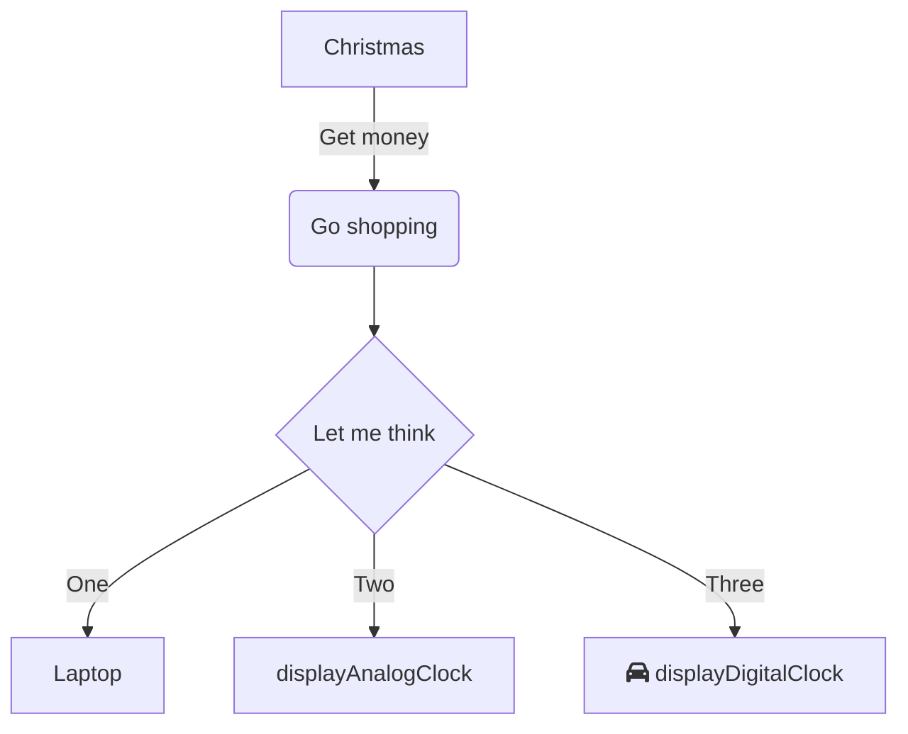

```mermaid
graph TD
    A[Christmas] -->|Get money| B(Go shopping)
    B --> C{Let me think}
    C -->|One| D[Laptop]
    C -->|Two| E[displayAnalogClock]
    C -->|Three| F[fa:fa-car displayDigitalClock]

%% Swimm:
%% graph TD
%%     A[Christmas] -->|Get money| B(Go shopping)
%%     B --> C{Let me think}
%%     C -->|One| D[Laptop]
%%     C -->|Two| E[<SwmToken path="/scripts/components/analog-clock.js" pos="6:4:4" line-data="export const displayAnalogClock = (cellNum) =&gt; {">`displayAnalogClock`</SwmToken>]
%%     C -->|Three| F[fa:fa-car <SwmToken path="/scripts/components/digital-clock.js" pos="3:2:2" line-data="const displayDigitalClock = (cellNum) =&gt; {">`displayDigitalClock`</SwmToken>]
```

&nbsp;

<SwmMeta version="3.0.0" repo-id="Z2l0aHViJTNBJTNBc21hcnQtbWlycm9yJTNBJTNBSWRpdFllZ2VyU3dpbW0=" repo-name="smart-mirror">Powered by [Swimm](https://staging.swimm.cloud/)</SwmMeta>
